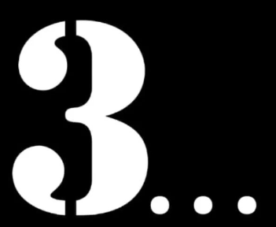
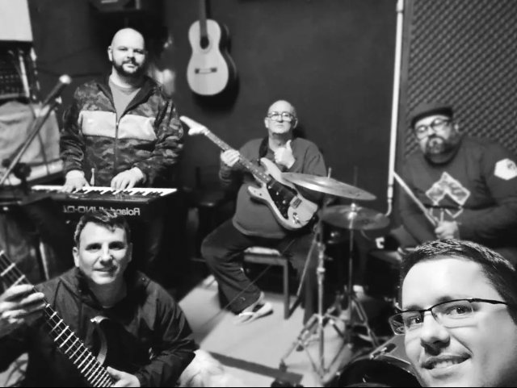
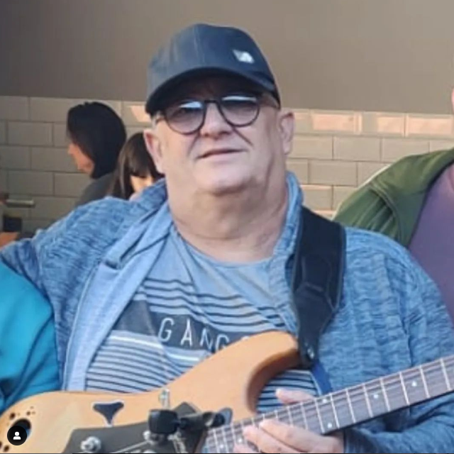
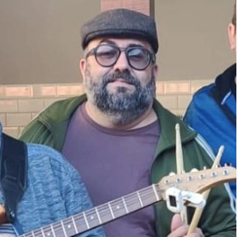
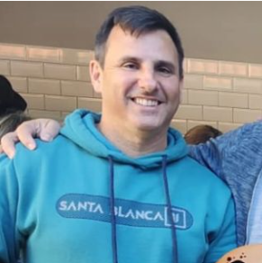
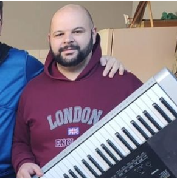

<!DOCTYPE html>
<html lang="pt-br">
<head>
    <meta charset="UTF-8">
    <meta http-equiv="X-UA-Compatible" content="IE=edge">
    <meta name="viewport" content="width=device-width, initial-scale=1.0">
    <title>Banda Eramos 3</title>
    <link rel="stylesheet" href="style.css">
    <link rel="shortcut icon" href="Imagens/Flat-Icons.com-Flat-Guitar.ico" type="image/x-icon">

</head>
<body>
    <header>
        
        <nav>
            <a href="#">Agenda</a>
            <a href="#">Contatos</a>
            <a href="#">Loja</a>     
        </nav>
        
        
    </header>

    <section id="y1" >
        
    </section>

    <section  class="h11">
        
Somos a banda éramos 3, que começou com a ideia de 3 amigos (Fabiano, Kall e Roberto) se reunindo para tirar um som juntos, já sabendo que logo, logo, não seriam apenas 3.

    </section>

    <section id="imgg">
        <h2>Firmados na Palavra do Senhor</h2>
        
Este é o dia que fez o Senhor; regozijemo-nos, e alegremo-nos nele. Salmos 118:24.

    </section>
    

        
    

        <section >
        

            
            

            <h2>O Maestro</h2>
            
Violão, Guitarra e voz. Esse é o nosso maestro! João Carlos ou Kall para os íntimos. Temos a honra de ter em nossa banda esse tão experiente músico e cantor "hors concours"

        

        

            
            

            <h2>O Milagre</h2>
            
Há 22 anos longe da Bateria e sem o movimento dos pés pela sequela do Covid, Roberto segue tentando sustentar o compasso da vanera.

        

        

            
            

            <h2>O Gaucho</h2>
            
O único autêntico gaúcho da banda. Fabiano é um experiente baixista de vanerão das bailandas do sul, agora louvando a Jesus com seu talento.

        

        

            
            

             <h2><strong> O Musico</strong></h2>
             
Teclado, Gaita, Metais, Saxofone e Vocal. Não existe Instrumento que assuste esse mestre da Musica. Depois de anos longe da música, Tiago aceitou convite do Mestre e veio somar com a Banda Éramos 3 e voltou para o mar.

        

        

            
            

                <h2><strong> O Aventureiro</strong></h2>
                
Contando com anos de experiência no Heavy Metal, Diego se aventura nos ritmos regionais do Sul..

        

    </section>

    <footer>
       <h2> Igreja Amar - Portal 2</h2>
       
Rua Nono Emílio Dalçóquio 201, Espinheiros (lotemamento Portal 2), Itajaí-SC

    </footer>
    
</body>
</html>